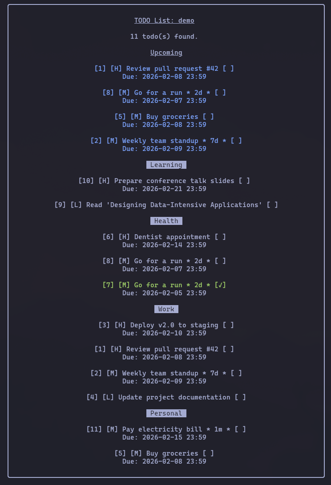

# Todo

A command-line todo application written in C, backed by SQLite3.



The screenshot above shows a named list (`todo demo -l`) demonstrating:

- **Categories** — tasks grouped under Learning, Health, Work and Personal
- **Priorities** — high `[H]`, medium `[M]` and low `[L]`
- **Upcoming section** — items due within 3 days highlighted at the top
- **Due dates** — absolute and relative dates displayed beneath each task
- **Repeating tasks** — marked with intervals like `* 7d *` (weekly) and `* 1m *` (monthly)
- **Completed task** — shown in green with a `[✓]` checkmark
- **Named list** — heading shows "TODO List: demo", stored separately from the default list

## Features

- Add, edit, delete and complete todos
- Organise by category and priority (low/medium/high)
- Due dates with absolute (`YYYY-MM-DD`) or relative (`3d`, `2w`, `1m`, `1y`) formats
- Repeating tasks (daily or monthly intervals)
- View todos by schedule: today, this week, this month, or all scheduled
- Filter by category and status
- Batch operations (complete or delete multiple todos at once)
- View recently completed todos
- Named lists to keep separate sets of todos (e.g. `work`, `personal`)
- Move todos between lists (single or batch)

## Dependencies

### Arch Linux

```sh
sudo pacman -S sqlite
```

### Debian/Ubuntu

```sh
sudo apt-get install libsqlite3-dev
```

### macOS (Homebrew)

```sh
brew install sqlite
```

## Building

```sh
make
```

For a debug build:

```sh
make DEBUG=1
```

## Installation

```sh
sudo make install    # installs to /usr/local/bin
sudo make uninstall  # removes it
```

## Usage

### Adding todos

```sh
todo --add "Buy groceries" --category shopping --priority 2
todo --add "Submit report" --due 2025-06-15
todo --add "Submit report" --due 3d              # due in 3 days
todo --add "Weekly review" --due 2025-06-15 --repeat 7d
```

### Listing and filtering

```sh
todo --list
todo --list --category work --status pending
todo --today          # due today
todo --week           # due within 7 days
todo --month          # due within 31 days
todo --schedule       # all scheduled todos by due date
todo --cat            # list all categories
```

### Managing todos

```sh
todo --complete 5             # mark single todo as completed
todo --complete '[1,2,3]'     # mark multiple todos as completed
todo --delete 5
todo --delete '[1,2,3]'
todo --edit 3 --title "Updated title" --priority 3
todo --show 3                 # show full details
todo --completed-since 2025-01-01
```

### Due date formats

| Format | Example | Meaning |
|--------|---------|---------|
| `YYYY-MM-DD` | `2025-06-15` | Specific date (end of day) |
| `YYYY-MM-DD HH:MM` | `2025-06-15 14:00` | Specific date and time |
| `Nd` | `3d` | 3 days from now |
| `Nw` | `2w` | 2 weeks from now |
| `Nm` | `1m` | 1 month from now |
| `Ny` | `1y` | 1 year from now |

### Repeat intervals

```sh
todo --add "Standup" --due 2025-06-15 --repeat 1d   # daily
todo --add "Review" --due 2025-06-15 --repeat 7d    # weekly
todo --add "Report" --due 2025-06-15 --repeat 2m    # every 2 months
```

### Named lists

```sh
todo work --add "Finish report" --priority 3   # adds to the 'work' list
todo work --list                               # lists only the 'work' list
todo --list                                    # default list (unchanged)
todo --lists                                   # show all available lists
todo --move 7 projects                         # move #7 from default to 'projects'
todo work --move 3 personal                    # move #3 from 'work' to 'personal'
todo demo --move '[7,8,9]' work                # batch move from 'demo' to 'work'
```

List names may contain letters, numbers, hyphens and underscores. Target lists are created automatically if they don't exist.

## Data storage

The default database is stored at `~/.local/share/todo/todos.db`. Named lists are stored alongside it as `~/.local/share/todo/<name>.db`.

## License

This project is unlicensed. Feel free to use it however you like.
